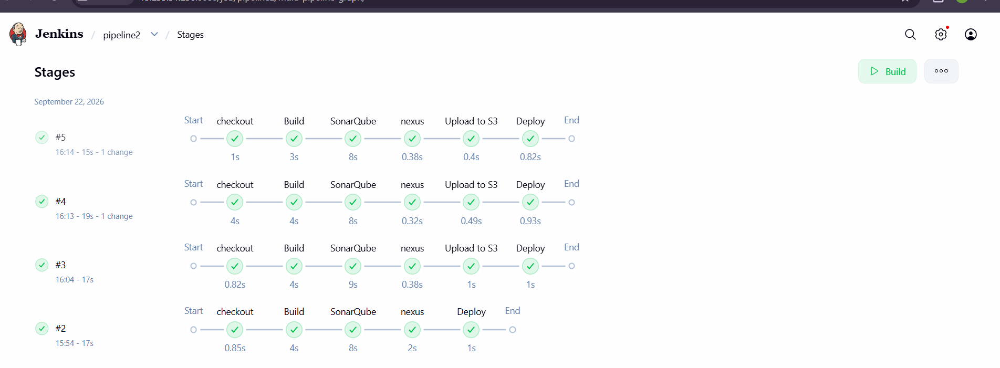
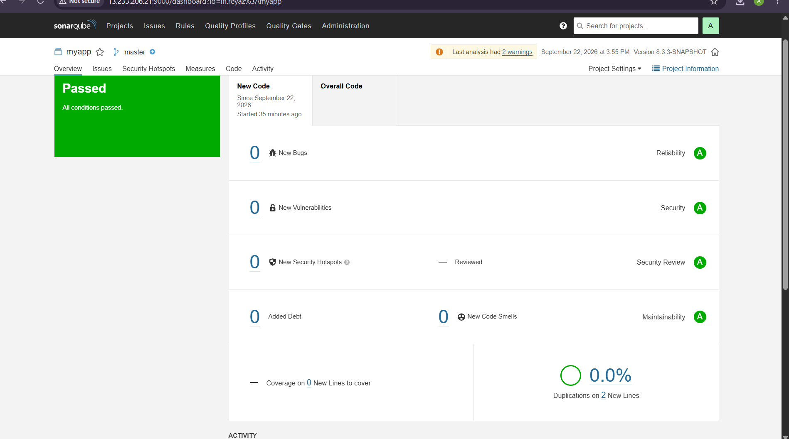
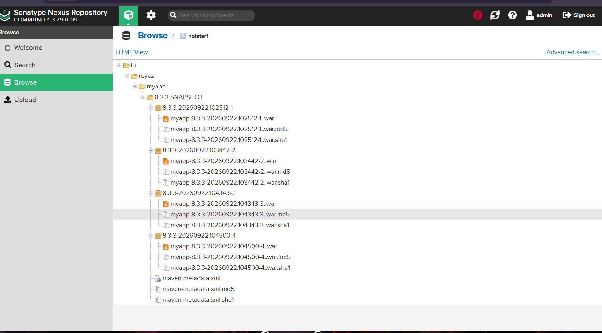
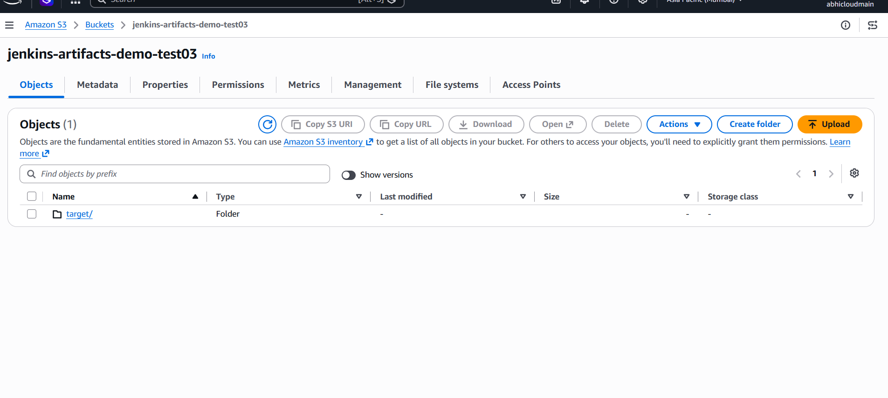
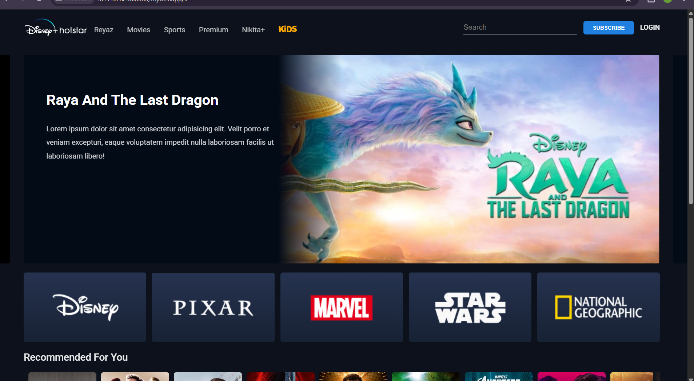

# Automated Java CI/CD Pipeline

## Author

**Abhishek Saste**

## Project Overview

This project demonstrates an end-to-end automated CI/CD pipeline for a Maven-based Java WAR application.

The source code is maintained in a separate GitHub repository and Jenkins automatically builds, analyzes, packages, publishes, stores, and deploys the application.

## Source Code Repository

GitHub:

https://github.com/abhisheksaste31-source/java-project-maven-new

## CI/CD Workflow

```text
Developer
    |
    v
 GitHub
    |
    | Webhook / Jenkins Trigger
    v
 Jenkins
    |
    v
 Maven Clean Package
    |
    v
 SonarQube Analysis
    |
    v
 Nexus Repository
    |
    v
 AWS S3 Artifact Backup
    |
    v
 Apache Tomcat
    |
    v
 Deployed Application
```

## Technologies Used

| Technology | Purpose |
|---|---|
| GitHub | Source Code Management |
| Jenkins | CI/CD Automation |
| Maven | Build, Test and Package |
| SonarQube | Static Code Quality Analysis |
| Nexus Repository | Artifact Management |
| AWS S3 | Artifact Backup / Storage |
| Apache Tomcat | WAR Deployment |

## Pipeline Stages

### 1. Checkout

Jenkins checks out the Java application from GitHub.

### 2. Build & Test

Maven executes:

```bash
mvn clean package
```

The application is packaged as:

```text
target/myapp.war
```

### 3. SonarQube

Jenkins sends the Maven project to SonarQube for static code analysis.

### 4. Nexus

The generated WAR artifact is uploaded to Nexus Repository.

Artifact details:

```text
Group ID    : in.reyaz
Artifact ID : myapp
Version     : 8.3.3-SNAPSHOT
Packaging   : WAR
```

### 5. AWS S3

The generated WAR file is uploaded to an Amazon S3 bucket as an additional artifact backup.

### 6. Tomcat Deployment

Jenkins automatically deploys the WAR artifact to Apache Tomcat.

Application context:

```text
mywebapp
```

## Project Structure

```text
java-cicd-pipeline/
│
├── Jenkinsfile
├── README.md
├── .gitignore
│
├── scripts/
│   ├── deploy.sh
│   ├── rollback.sh
│   └── health-check.sh
│
├── docs/
│   ├── architecture.png
│   └── SETUP.md
│
└── screenshots/
    ├── 01-jenkins-success.png
    ├── 02-sonarqube-quality-gate.png
    ├── 03-nexus-artifact.png
    ├── 04-s3-artifact.png
    └── 05-tomcat-deployment.png
```

## Screenshots

### Jenkins Pipeline



### SonarQube Quality Gate



### Nexus Artifact



### AWS S3 Artifact



### Tomcat Deployment



## Security

Never commit:

- AWS access keys
- AWS secret keys
- Jenkins passwords
- Nexus passwords
- SonarQube tokens
- SSH private keys
- `.env` files containing secrets

Use Jenkins Credentials and AWS IAM roles/credentials instead.

## Important Configuration

Before using the Jenkinsfile, replace:

```text
YOUR_NEXUS_HOST
YOUR_S3_BUCKET
YOUR_TOMCAT_HOST
```

with your environment values.

The repository intentionally does not contain real infrastructure credentials or secrets.

## Future Enhancements

- SonarQube Quality Gate enforcement
- Automated health checks
- Automated rollback
- Docker containerization
- AWS ECR/ECS deployment
- Kubernetes deployment
- Prometheus and Grafana monitoring
- Slack/email notifications
- Blue-green deployment
- Canary deployment

## Author

**Abhishek Saste**
