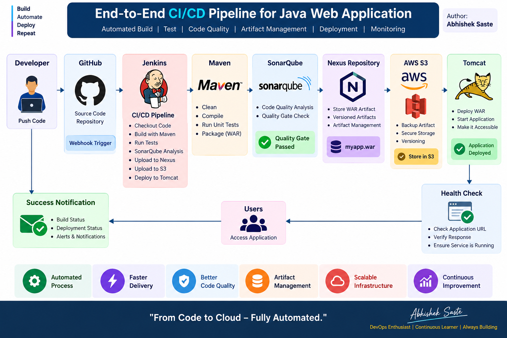

# 🚀 Automated Java CI/CD Pipeline

### End-to-End DevOps Automation with Jenkins, Maven, SonarQube, Nexus, AWS S3 & Apache Tomcat

> **From Code Commit to Production Deployment — Fully Automated CI/CD Pipeline**

**Author:** Abhishek Saste

---

## 📌 Project Overview

This project demonstrates an **end-to-end automated CI/CD pipeline** for a Java Maven-based web application.

Whenever new code is pushed to GitHub, Jenkins automatically starts the pipeline and performs the complete software delivery process:

```text
Code → Build → Test → Code Quality → Artifact → Backup → Deploy → Verify
```

The pipeline integrates **GitHub, Jenkins, Maven, SonarQube, Nexus Repository, AWS S3, and Apache Tomcat** to automate application delivery.

---

## 🏗️ Architecture



### 🔄 CI/CD Flow

```text
Developer
    │
    ▼
  GitHub
    │
    │ Webhook / Trigger
    ▼
 Jenkins
    │
    ▼
 Maven Build & Test
    │
    ▼
 SonarQube
    │
    ▼
 Code Quality Analysis
    │
    ▼
 Nexus Repository
    │
    ├──────────────► AWS S3
    │                Artifact Backup
    │
    ▼
 Apache Tomcat
    │
    ▼
 Application Deployed
    │
    ▼
 Health Check
```

---

## 🛠️ Technologies Used

| Technology                 | Purpose                      |
| -------------------------- | ---------------------------- |
| 🐙 **GitHub**              | Source Code Management       |
| 🔧 **Jenkins**             | CI/CD Pipeline Automation    |
| 🪶 **Maven**               | Build, Test & WAR Packaging  |
| 🔍 **SonarQube**           | Static Code Quality Analysis |
| 📦 **Nexus Repository**    | Artifact Repository          |
| ☁️ **AWS S3**              | Artifact Backup & Storage    |
| 🐱 **Apache Tomcat**       | Java WAR Deployment          |
| 🐧 **Linux**               | Server Environment           |
| 🔐 **Jenkins Credentials** | Secure Credential Management |

---

## ⚙️ Pipeline Stages

### 1️⃣ Checkout

Jenkins automatically checks out the application source code from GitHub.

```text
GitHub
   ↓
Jenkins Checkout
```

Source repository:

🔗 https://github.com/abhisheksaste31-source/java-project-maven-new

---

### 2️⃣ Build & Test

Maven performs the build and executes the project's test lifecycle.

```bash
mvn clean package
```

The application generates:

```text
target/myapp.war
```

---

### 3️⃣ SonarQube Analysis

The source code is analyzed using SonarQube.

The pipeline checks:

* Code quality
* Bugs
* Vulnerabilities
* Code smells
* Maintainability
* Reliability

```text
Maven
   ↓
SonarQube
   ↓
Code Quality Analysis
```

---

### 4️⃣ Nexus Artifact Repository

After successful build and analysis, the WAR artifact is uploaded to Nexus.

```text
Group ID     : in.reyaz
Artifact ID  : myapp
Version      : 8.3.3-SNAPSHOT
Packaging    : WAR
Repository   : hotstar1
```

Artifact:

```text
myapp.war
```

---

### 5️⃣ AWS S3 Artifact Backup

The generated WAR file is also uploaded to Amazon S3.

Benefits:

* Artifact backup
* Centralized storage
* Versioned releases
* Easy recovery
* Cloud-based artifact storage

```text
Jenkins
   │
   ▼
myapp.war
   │
   ▼
AWS S3
```

---

### 6️⃣ Apache Tomcat Deployment

Jenkins automatically deploys the WAR artifact to Apache Tomcat.

Application context:

```text
mywebapp
```

Deployment flow:

```text
Jenkins
   ↓
WAR Artifact
   ↓
Tomcat
   ↓
Java Web Application
```

---

### 7️⃣ Deployment Verification

After deployment, the application can be verified using a health-check step.

Example:

```bash
curl --fail http://localhost:8080/mywebapp/
```

This helps verify that the application is accessible after deployment.

---

# 🔥 Complete Pipeline

```text
                    ┌─────────────────┐
                    │    Developer    │
                    └────────┬────────┘
                             │
                             ▼
                    ┌─────────────────┐
                    │     GitHub      │
                    └────────┬────────┘
                             │
                         Webhook
                             │
                             ▼
                    ┌─────────────────┐
                    │     Jenkins     │
                    └────────┬────────┘
                             │
                             ▼
                    ┌─────────────────┐
                    │ Maven Build/Test│
                    └────────┬────────┘
                             │
                             ▼
                    ┌─────────────────┐
                    │    SonarQube    │
                    │  Code Analysis  │
                    └────────┬────────┘
                             │
                             ▼
                    ┌─────────────────┐
                    │      Nexus      │
                    │  WAR Artifact   │
                    └────────┬────────┘
                             │
                    ┌────────┴────────┐
                    ▼                 ▼
             ┌─────────────┐   ┌─────────────┐
             │   AWS S3    │   │   Tomcat    │
             │   Backup    │   │  Deployment │
             └─────────────┘   └──────┬──────┘
                                      │
                                      ▼
                               ┌─────────────┐
                               │Health Check │
                               └─────────────┘
```

---

# 📂 Project Structure

```text
automated-ci-cd-pipeline/
│
├── README.md
├── Jenkinsfile
├── .gitignore
│
├── docs/
│   ├── architecture.png
│   ├── architecture.md
│   └── SETUP.md
│
├── screenshots/
│   ├── 01-jenkins-success.png
│   ├── 02-sonarqube-quality-gate.png
│   ├── 03-nexus-artifact.png
│   ├── 04-s3-artifact.png
│   └── 05-tomcat-deployment.png
│
└── scripts/
    ├── deploy.sh
    ├── rollback.sh
    └── health-check.sh
```

---

# 📸 Pipeline Screenshots

## Jenkins Pipeline


---

## SonarQube Quality Gate


---

## Nexus Artifact


---

## AWS S3 Artifact


---

## Tomcat Deployment


---

# 🔐 Security

No sensitive credentials should be committed to GitHub.

The pipeline uses Jenkins credential IDs instead of storing passwords directly inside the pipeline.

Sensitive information includes:

```text
❌ AWS Access Key
❌ AWS Secret Key
❌ Nexus Password
❌ SonarQube Token
❌ Tomcat Password
❌ SSH Private Key
❌ .env Secrets
```

Use:

```text
Jenkins Credentials
        +
AWS IAM
        +
Environment Variables
```

for secure configuration.

---

# 🎯 Key DevOps Concepts Demonstrated

This project demonstrates practical knowledge of:

* ✅ Continuous Integration
* ✅ Continuous Delivery / Deployment
* ✅ Jenkins Declarative Pipeline
* ✅ Git-based Source Control
* ✅ Maven Build Automation
* ✅ Automated Testing
* ✅ Static Code Analysis
* ✅ Quality Gate
* ✅ Artifact Management
* ✅ Nexus Repository
* ✅ AWS S3
* ✅ WAR Deployment
* ✅ Apache Tomcat
* ✅ Jenkins Credentials
* ✅ Linux Deployment
* ✅ Post-deployment Verification

---

# 🚀 How the Pipeline Works

### Developer pushes code

```bash
git add .
git commit -m "Update application"
git push
```

### Jenkins starts

```text
GitHub
   ↓
Jenkins
```

### Jenkins executes

```text
Checkout
   ↓
Maven Build
   ↓
Test
   ↓
SonarQube
   ↓
Nexus
   ↓
AWS S3
   ↓
Tomcat
   ↓
Health Check
```

### Result

```text
✅ Build Successful
✅ Tests Passed
✅ Code Analyzed
✅ Artifact Published
✅ Artifact Backed Up
✅ Application Deployed
```

---

# 📈 Future Enhancements

The project can be extended with:

* 🐳 Docker containerization
* ☸️ Kubernetes deployment
* ☁️ AWS ECR / ECS
* 📊 Prometheus monitoring
* 📈 Grafana dashboards
* 🔔 Slack notifications
* 📧 Email notifications
* 🔄 Automated rollback
* 🔵🟢 Blue-Green Deployment
* 🟡 Canary Deployment
* 🔐 HashiCorp Vault
* 🚦 Automated deployment approval

---

# 👨‍💻 Author

## Abhishek Saste

**DevOps | Cloud | Java | CI/CD**

This project was created to demonstrate practical implementation of an automated DevOps CI/CD workflow using Jenkins and AWS-based infrastructure.

---

### ⭐ If you find this project useful, consider giving the repository a Star!

**From Code to Cloud — Fully Automated. 🚀**
